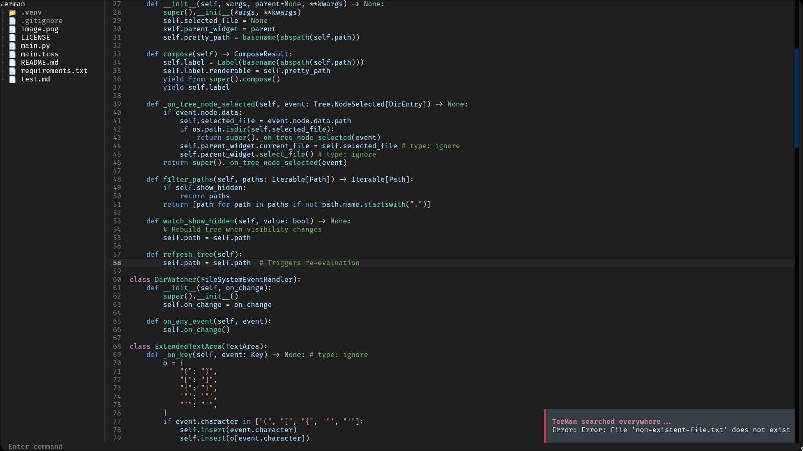

# TerMan

TerMan is a terminal-inspired text editor and file manager built using the [Textual](https://github.com/Textualize/textual) framework. It provides a minimalistic interface for navigating directories, editing files, and executing basic file system commands.

## Features

- **Directory Tree Navigation**: Browse and manage files and directories with a collapsible tree view.
- **File Editing**: Edit files with syntax highlighting for Python and Markdown.
- **Command Input**: Execute file system commands directly from the command input bar.
- **Keyboard Shortcuts**: Perform actions quickly using intuitive keyboard shortcuts.
- **File System Monitoring**: Automatically refresh the directory tree when changes are detected.
- **Customizable UI**: Styled with a dark theme for a sleek and modern look.

## Commands

TerMan supports the following commands:

- `help`: Display a list of all available commands.
- `q`, `Q`, `quit`, `exit`: Exit the application.
- `touch <file>`: Create a new file.
- `rm <file>`: Delete a file.
- `mkdir <dir>`: Create a new directory.
- `rmdir <dir>`: Remove an empty directory.
- `cd <dir>`: Change the current working directory.
- `cp <src> <dst>`: Copy a file from source to destination.
- `mv <src> <dst>`: Move or rename a file.

## Keyboard Shortcuts

- `Ctrl+H`: Toggle visibility of hidden files.
- `Ctrl+C`: Clear the command input bar.
- `Ctrl+E`: Focus the command input bar.
- `Ctrl+A`: Select all text in the editor.
- `Ctrl+V`: Paste clipboard content into the editor.
- `Ctrl+S`: Save the current file.

## Installation

- Clone the repository:

```bash
git clone https://github.com/e3nviction/terman.git
```

- Navigate to the project directory:

```bash
cd terman
```

- Install the required dependencies:

```bash
pip install -r requirements.txt
```

- Run the application:

```bash
python main.py
```

## Requirements

- Python 3.8 or higher
- [Textual](https://github.com/Textualize/textual)
- [Watchdog](https://github.com/gorakhargosh/watchdog)
- [Pyperclip](https://github.com/asweigart/pyperclip)

## License

This project is licensed under the MIT License. See the [LICENSE](LICENSE) file for details.

## Contributing

Contributions are welcome! Feel free to open issues or submit pull requests to improve TerMan.

## Screenshots


